# BonusMan

This project aims to design and develop a mobile application for the management of orders for Moroccan grocers using BONUS MANS (delivery drivers) who will replace the distribution chain and act as a direct intermediary between the production factory and the grocer. This allows grocers to have quick access to products.

# The supply chain, a complex network.

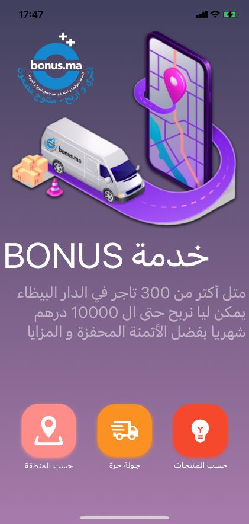

# Solution

To address this issue, we propose to add BONUS MANS or delivery agents to balance the load when there is a gap in the supply chain. With this solution, grocers will no longer need to wait for the chain as they used to. Instead, they can simply browse the products, place an order, and a BONUS MAN will deliver it - that's it!

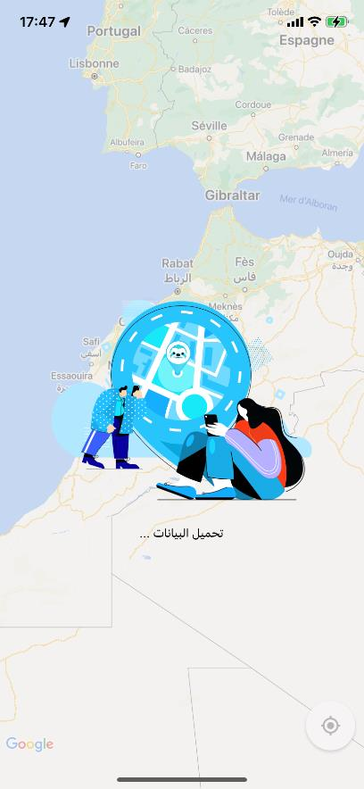

## some use cases

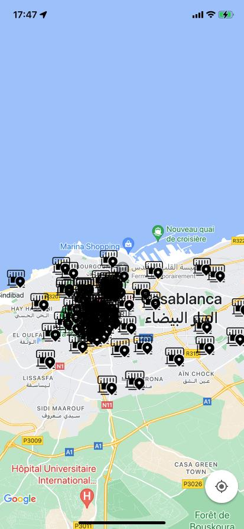

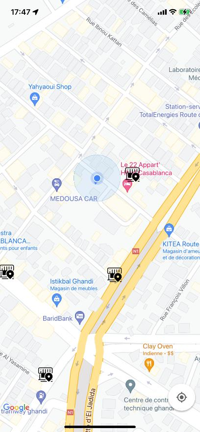

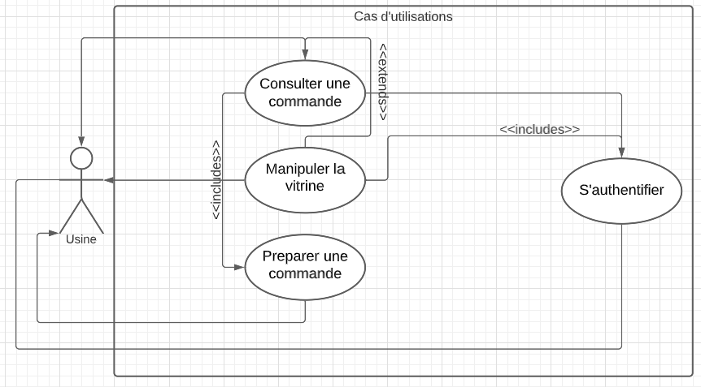

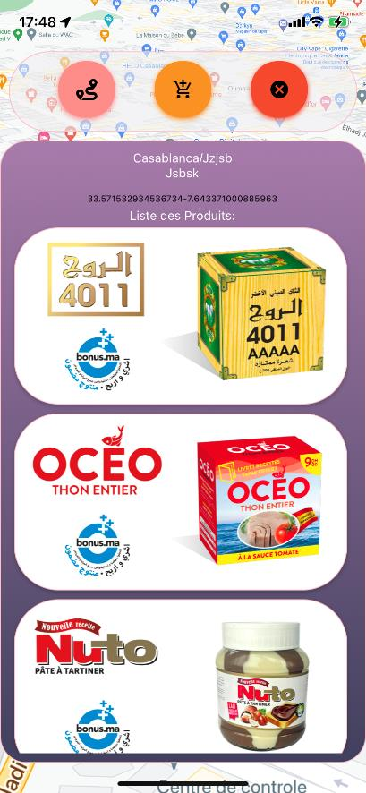

## Some Sequence diagram

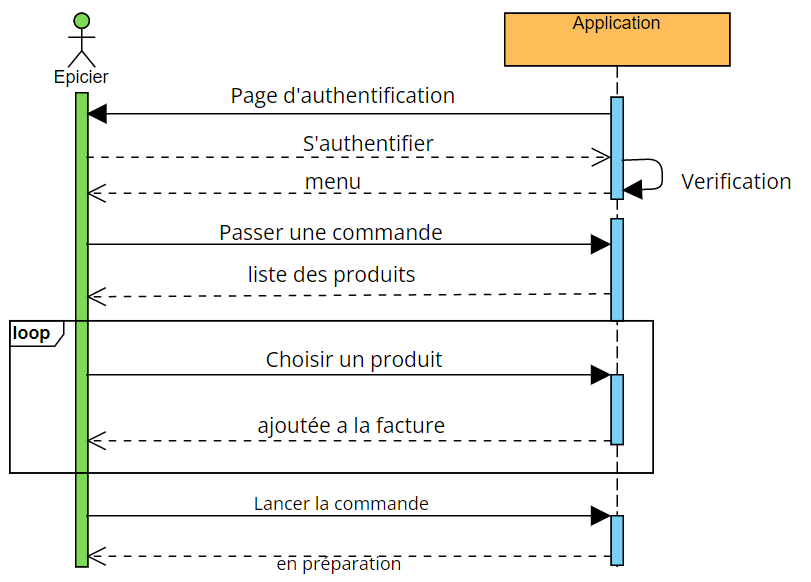

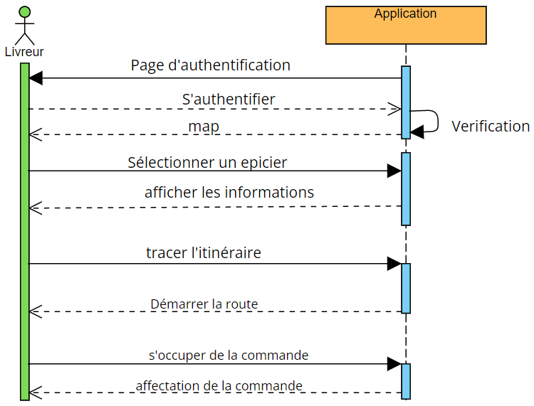

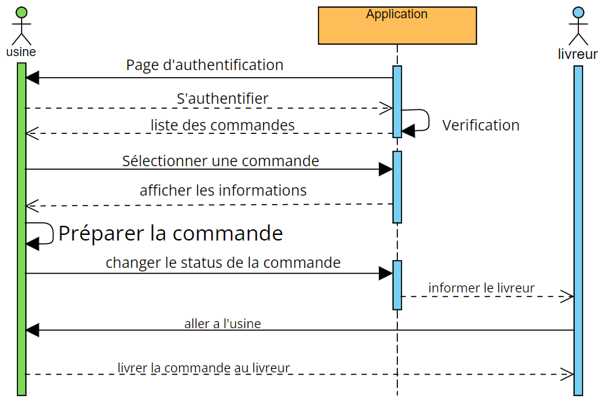

# CDM , LDM

A high-level graphical representation that easily illustrates how various elements are interconnected using diagrams encoded with entities, properties, and relationships that explain how entities are related to each other, including cardinalities.

Logical data modeling that takes into account the organizational level of data. It represents a logical view of data organization required for processing.

## Conceptual data model

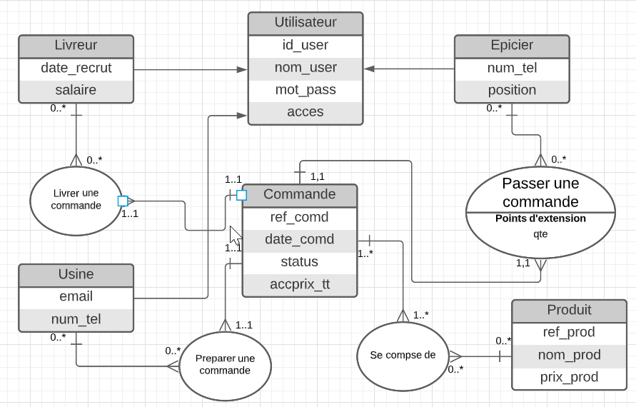

## Logical data model

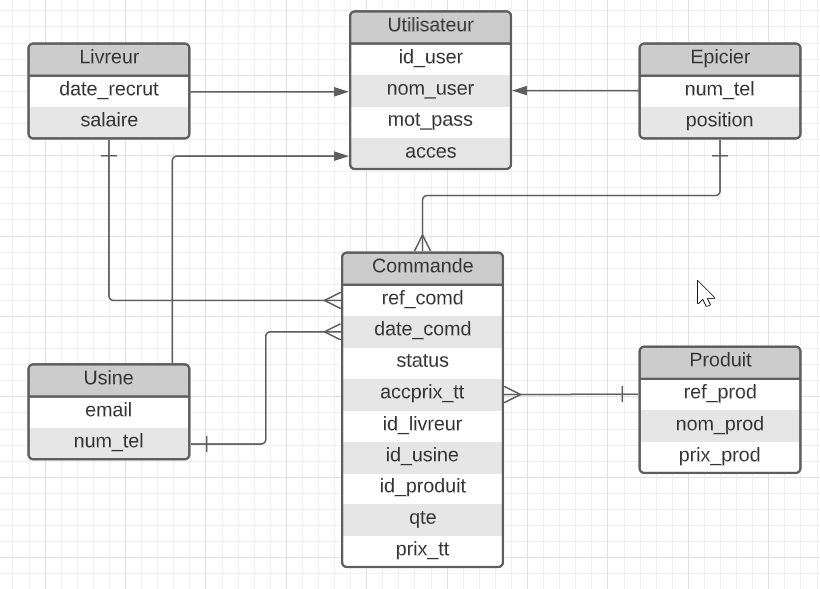