# BonusMan

This project aims to design and develop a mobile application for the management of orders for Moroccan grocers using BONUS MANS (delivery drivers) who will replace the distribution chain and act as a direct intermediary between the production factory and the grocer. This allows grocers to have quick access to products.

# The supply chain, a complex network.

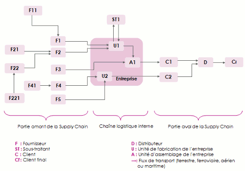

# Solution

To address this issue, we propose to add BONUS MANS or delivery agents to balance the load when there is a gap in the supply chain. With this solution, grocers will no longer need to wait for the chain as they used to. Instead, they can simply browse the products, place an order, and a BONUS MAN will deliver it - that's it!

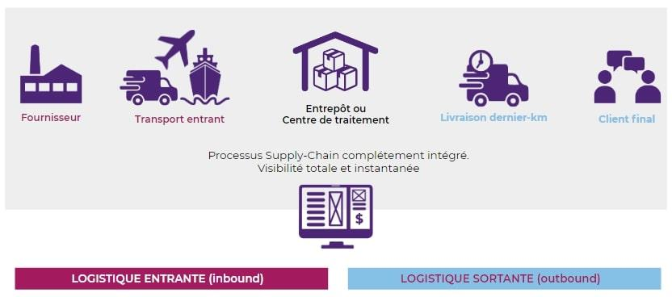

## some use cases

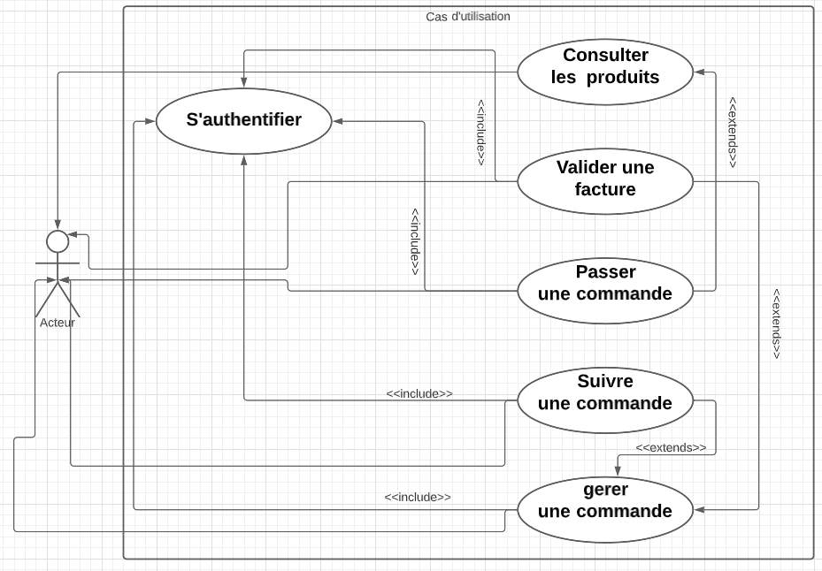

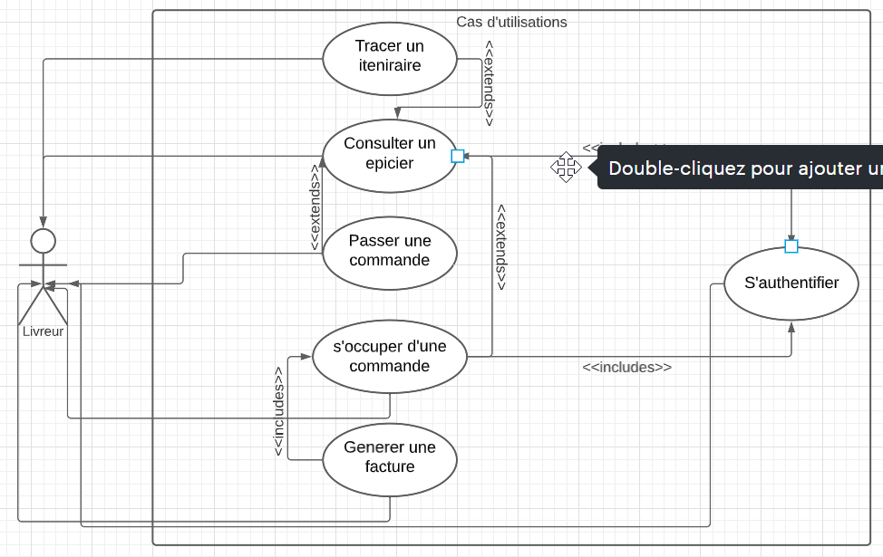

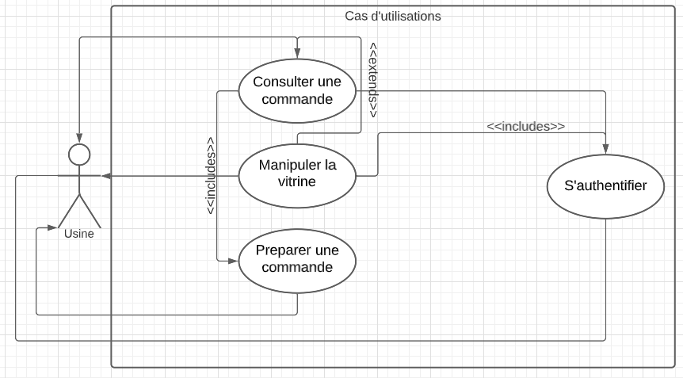

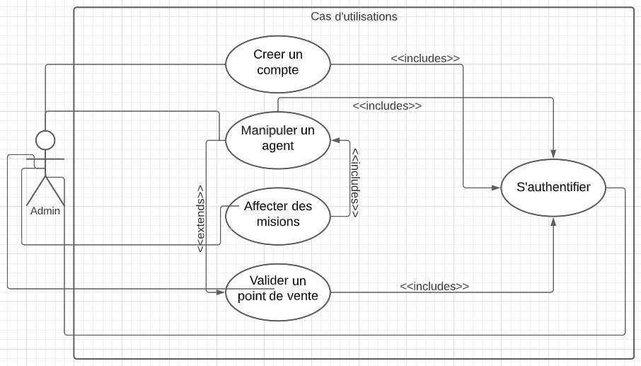

## Some Sequence diagram

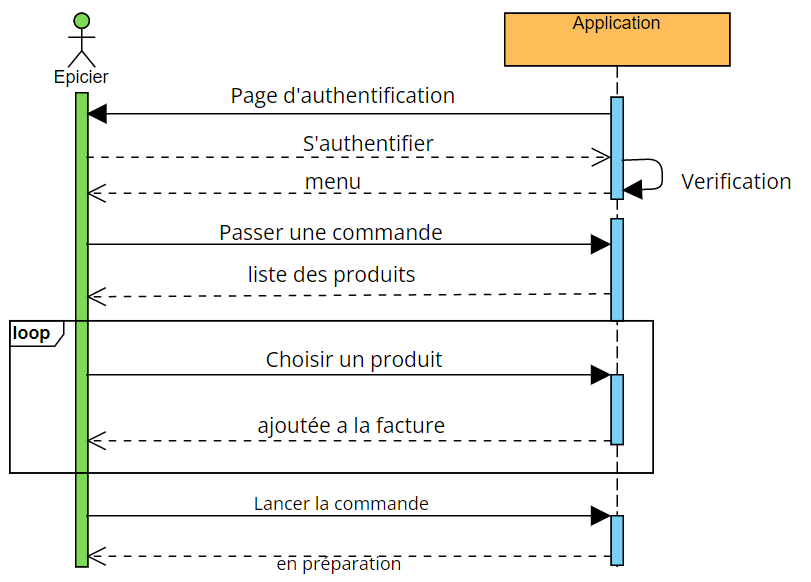

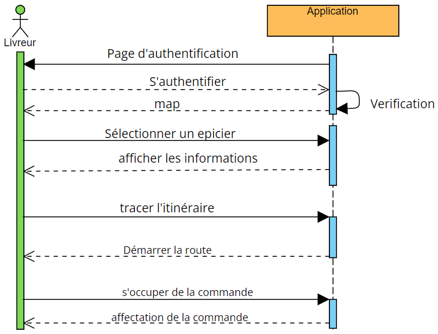

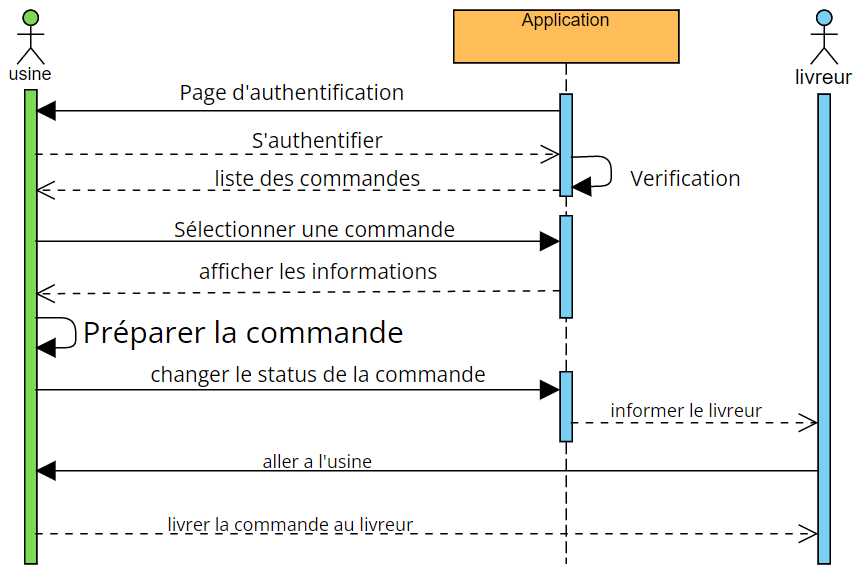

# CDM , LDM

A high-level graphical representation that easily illustrates how various elements are interconnected using diagrams encoded with entities, properties, and relationships that explain how entities are related to each other, including cardinalities.

Logical data modeling that takes into account the organizational level of data. It represents a logical view of data organization required for processing.

## Conceptual data model

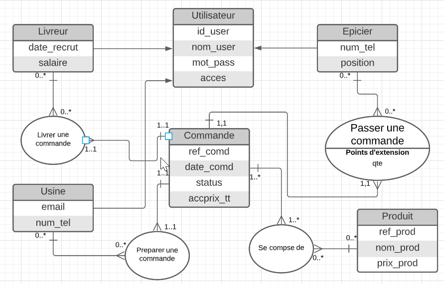

## Logical data model

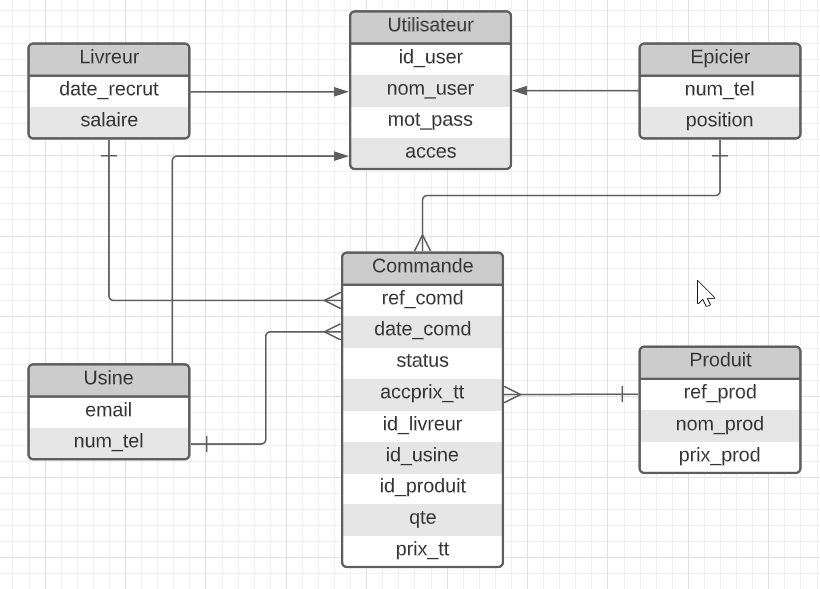

# THE APPLICATION

This work was carried out as part of our end-of-studies project, which aimed to design and develop a mobile application for the management and tracking of orders for Moroccan grocers. We have successfully created this application, which will provide the opportunity to replace the supply chain and avoid being among the victims of system breakdown.

### Menu 

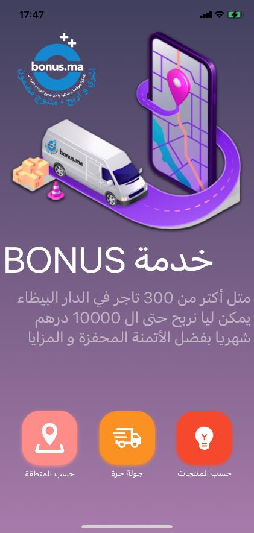 

### Loading sales points 

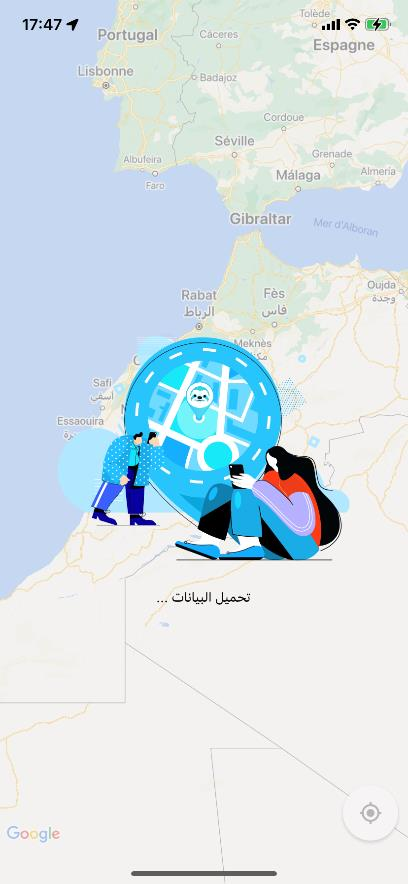 

### List of grocers within the predefined area. 

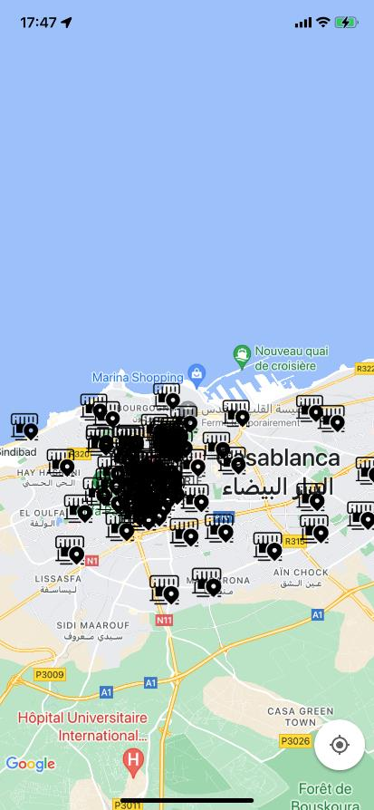

### Automatic detection of current location 

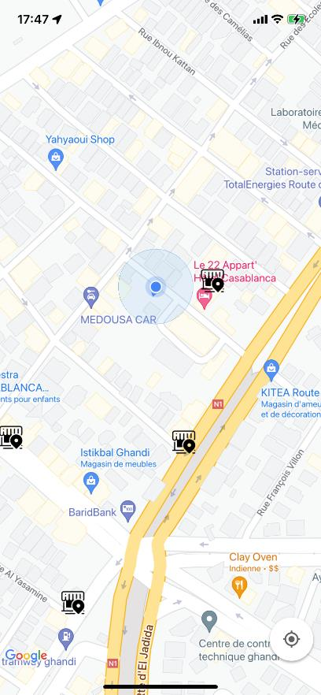 

### Select a sales point for more information.

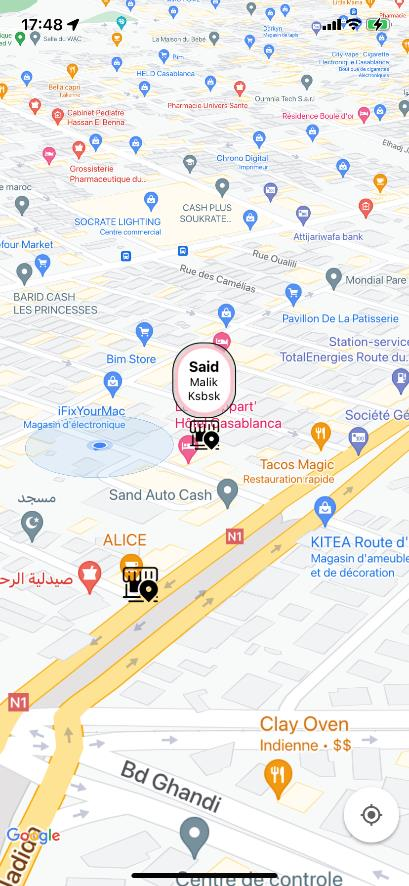 

### Usual product list 

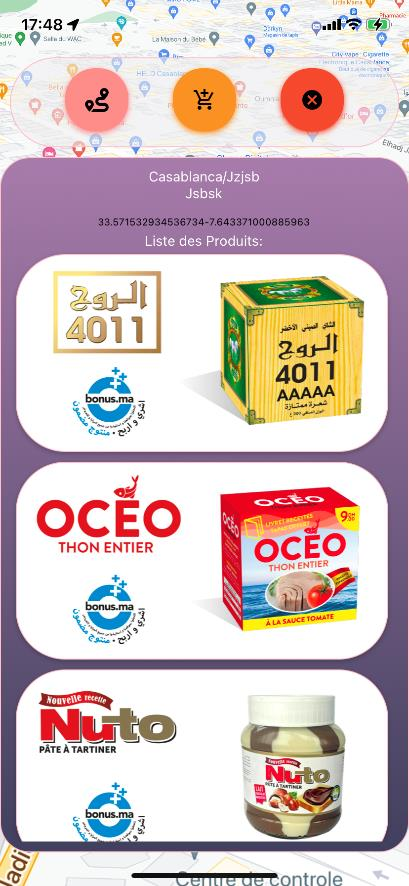

### Order box to place an order. 

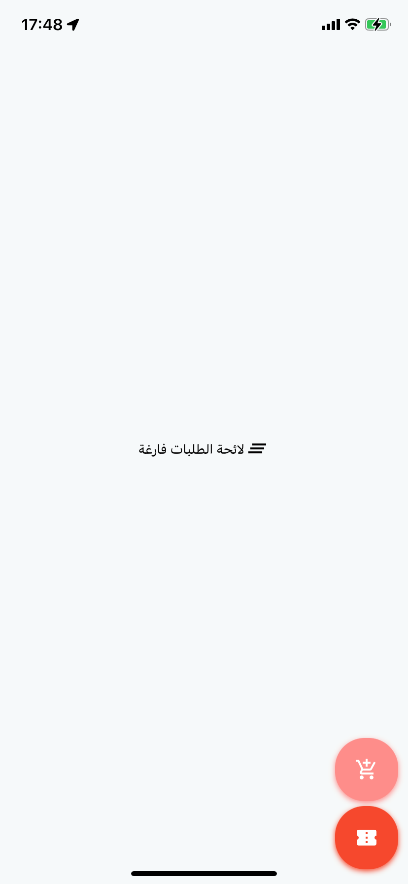 

### List of available products. 

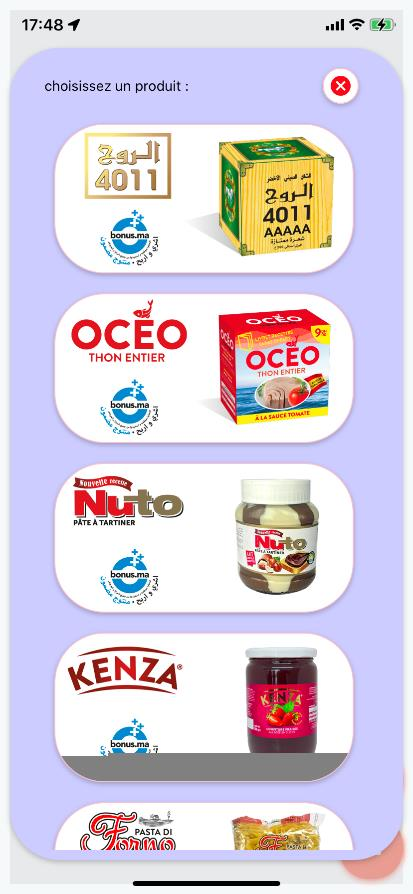 

### Quantité de produit 

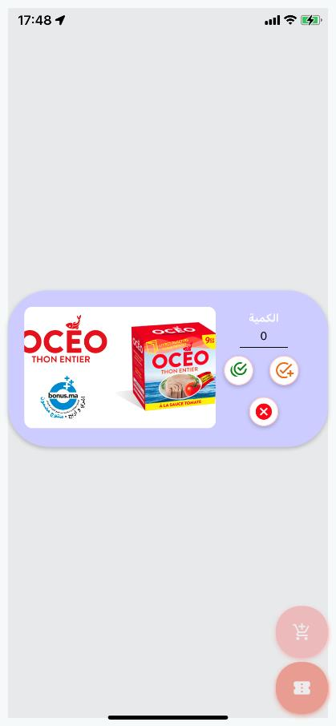

### Modify the quantity of an order. 

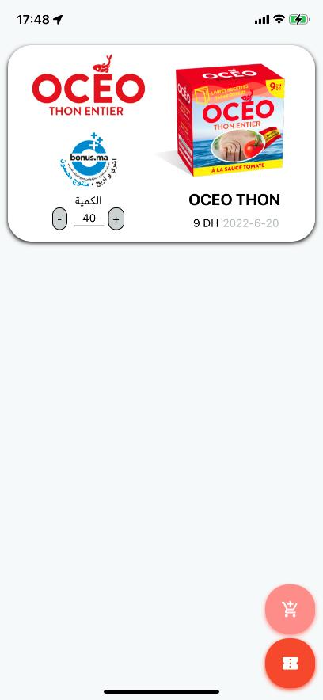 

### Order box ready for confirmation. 

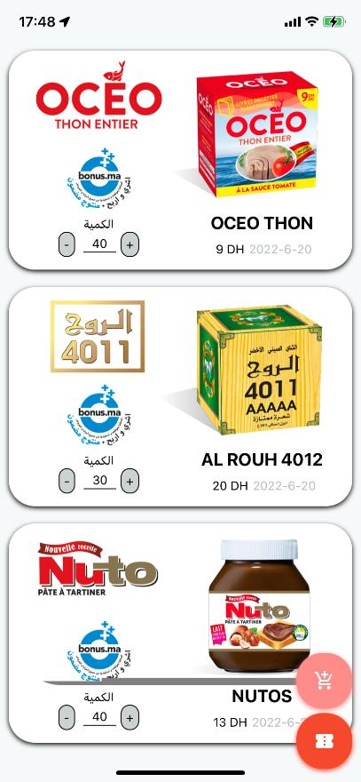

### Invoice generated automatically. 

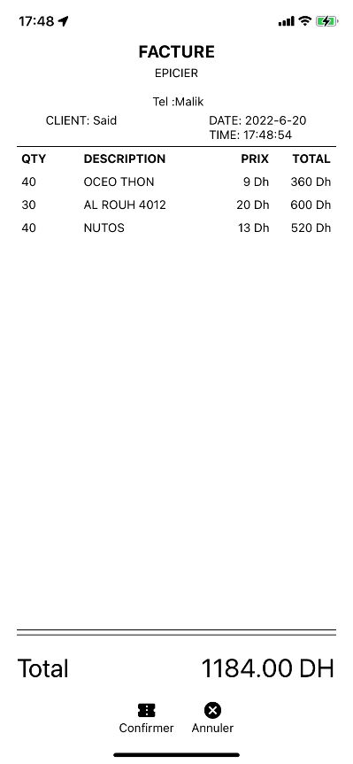

### Trace the route and start the journey. 

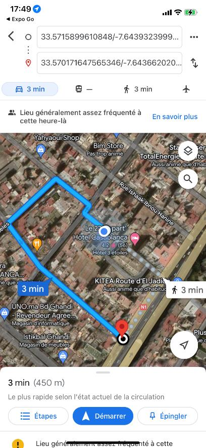

### Add a new sales point. 

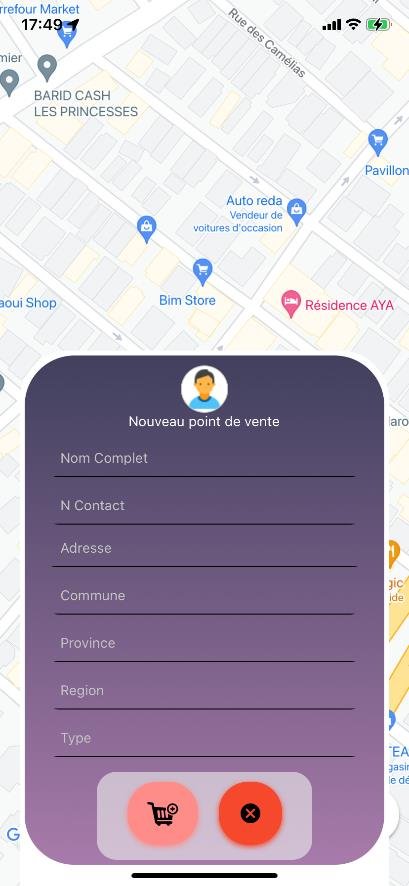

### Sales point temporarily added. 

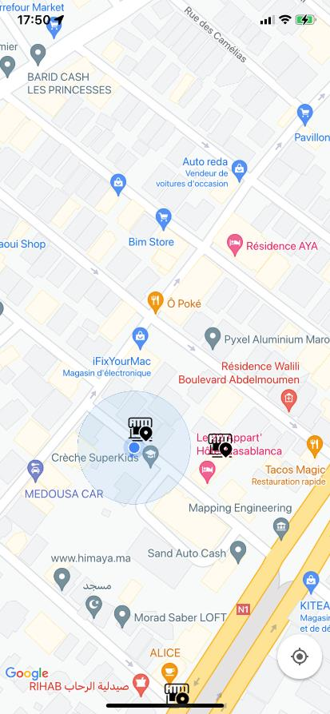

# Getting Started

These instructions will help you clone and set up the project on your local machine.

### Prerequisites

Before you begin, make sure you have the following installed on your development machine:

- [Node.js](https://nodejs.org/)
- [npm](https://www.npmjs.com/) (comes with Node.js)
- [React Native CLI](https://reactnative.dev/docs/environment-setup)

### Installing

Follow these steps to get the project up and running:

1. Clone the repository to your local machine:

   ```shell
   git clone https://github.com/Nouakchi/BonusMan.git
   cd project-name
   npm install
   npx react-native start
   ```